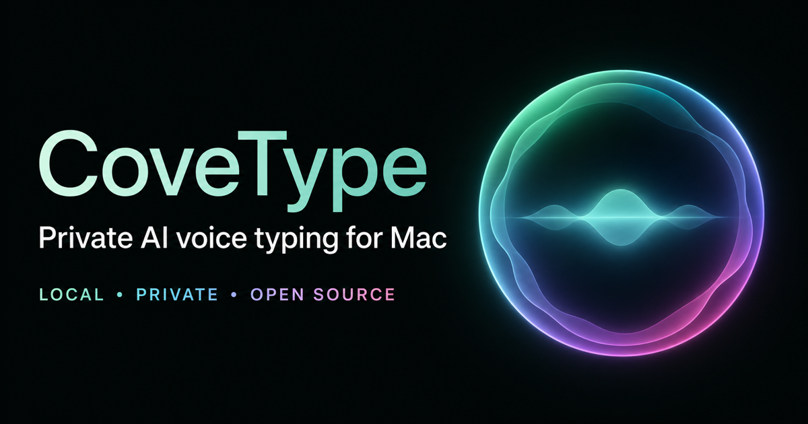

# CoveType

[English](README.md) | [Windows 方案](docs/WINDOWS.md)

[产品网站](https://covetype.com/) · [下载安装](https://github.com/Marklucif/CoveType/releases/tag/v2.1.5-beta.1) · [使用反馈](https://github.com/Marklucif/CoveType/issues/new) · [隐私说明](docs/PRIVACY.md) · [上游项目](https://github.com/marswaveai/TypeNo)

**CoveType** 是一款主打隐私和本地 AI 的 macOS 语音输入工具，基于开源 TypeNo 项目二次开发。按住快捷键说话，松开后由本地 Qwen3-ASR 识别，可选本地润色或 Apple 设备端即时翻译，结果自动粘贴到原应用。



## 当前功能

- Qwen3-ASR 0.6B 8-bit 本地识别，自动检测 30 种语言和 22 种中文方言。
- Qwen3.5 0.8B 4-bit 本地文字润色，可关闭或选择轻度、正式、精简。
- Apple Translation 设备端即时翻译，可选择 15 个目标语言选项。
- 动态麦克风波形、自动麦克风或指定输入设备。
- 菜单栏采用低开销呼吸灯，根据待机、聆听、本地处理、完成、权限、更新和错误显示不同颜色。
- 客户端原生“使用反馈”窗口，支持分类修改建议、可选系统信息和提交前隐私检查。
- 模型进程按需启动并短时复用；空闲后释放，避免长期占用大内存。
- 无账号；识别、润色和已下载语言包的翻译不连接网络大模型。
- 匿名使用统计默认开启，可在“使用反馈…”窗口关闭。每 24 小时最多通过 HTTPS 发送一次随机安装编号、应用/macOS 版本和处理器架构；服务端只判断国家，不保存原始 IP、录音、转录结果或输入文字。
- 使用独立的 CoveType 更新通道，原版 TypeNo 更新不会覆盖这套本地 AI 功能。

## 快捷键

| 操作 | 触发方式 |
|---|---|
| 按住说话 | 按住用户录制的单键或组合键，松开停止 |
| 自动兼容模式 | 按住 `Fn`、任一 `Option/Alt` 或任一 `Control` |
| 免按住模式 | `Fn + Space` 开始，再按一次停止 |
| 取消 | `Esc` |
| 菜单操作 | 菜单栏 → Record / Stop Recording |

打开菜单栏 CoveType → **快捷键设置…**，可直接录制实际键盘上的单键或组合键，并把触发前按住时长设为 0.10–1.50 秒，默认 0.32 秒。如果修饰键在时限内继续组成其他快捷键，就会取消录音触发，因此不会干扰 `Control + C` 等开发快捷键。“恢复自动兼容模式”可回到 Fn/Option/Control。

## 自动安装

完整安装包位于 `dist/CoveType-2.1.5-macOS-AppleSilicon-Installer.zip`。解压后双击 `Install CoveType.command`，脚本会自动安装应用、独立 Python/MLX 环境、两个模型、登录时自启动、默认配置并运行自检。权限向导会按照 macOS 默认语言显示说明、打开系统设置并检测授权结果。应用更新采用原位替换；用户录制的快捷键与按住时长也会保留。

CoveType 不会查询或安装 `marswaveai/TypeNo` 的原版发布，而是使用 `Marklucif/CoveType` 自己的更新清单和 Release。详见 [独立更新通道说明](docs/UPDATE_CHANNEL.md)。

菜单栏中的“使用反馈…”会生成 `Marklucif/CoveType` 的新 Issue 草稿，让用户检查后再公开提交；客户端不会静默发送反馈，也可以只在本地复制内容。

首个二进制版本作为公开预览版发布，因为当前开发环境尚未配置 Apple 公证凭据。应用已经使用 Developer ID 签名，但其他 Mac 首次打开下载版本时仍可能需要使用“按住 Control 点击 → 打开”。从源码构建不受影响。

支持 Apple 芯片与 macOS 15 以上版本，首次安装需要联网及至少 5 GB 可用空间。详见 [macOS 自动安装说明](docs/MACOS_AUTOMATED_INSTALL.md)。

从源码目录直接安装：

```zsh
./scripts/install_macos.command
```

macOS 不允许安装程序静默授予隐私权限。首次启动仍需本人允许麦克风、辅助功能，以及首次翻译时对应的 Apple 设备端语言包。

## Windows

Windows 不能直接运行 AppKit/SwiftUI、AVFoundation、Apple Translation 与 MLX 组成的 macOS 客户端。仓库现已提供官方 Qwen3-ASR/PyTorch 后端自动安装脚本和浏览器测试入口；完整的全局输入托盘客户端需要单独的 .NET 原生移植。详见 [Windows 使用与移植方案](docs/WINDOWS.md)。

## 本地数据

- 新安装应用：`/Applications/CoveType.app`，无系统目录写入权限时为 `~/Applications/CoveType.app`。
- 更新时会保留同一个 `CoveType.app` 外层目录并原位替换内容。
- 模型、独立运行环境与版本备份统一位于 `~/Library/Application Support/CoveType`。

## 许可证与上游

本项目继承上游 [marswaveai/TypeNo](https://github.com/marswaveai/TypeNo)，采用 GNU General Public License v3.0。CoveType 修改版维护于 [Marklucif/CoveType](https://github.com/Marklucif/CoveType)。Qwen 模型与依赖分别遵循其自身许可证。
